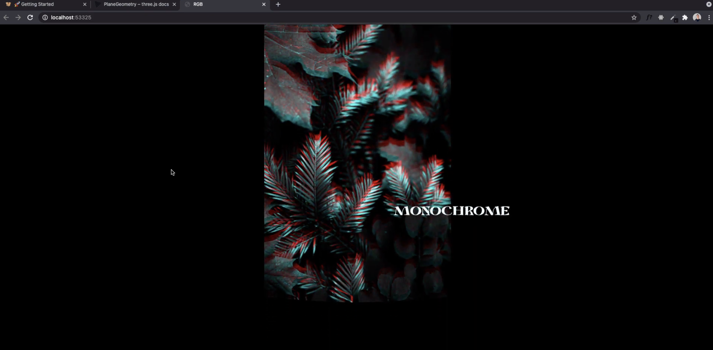

# zeli8353_9103_Quiz8

## Part 1 

The imaging of glitch art's RGB Split Glitch distorts the artistic image, and the glitch defects form an artistic visual form. It is also widely used in movies and art, giving the picture a mysterious sense of technology. This abstract and fragmented art style, the linearity of dazzling colors and the dislocation of blocks make the image stand out and unique.
#

## Part 2

*[Glitch Art-RGB Split]( https://github.com/conorbailey90/rgb-split-distortion-scroll-effect)

1. Set the basic settings of the image in css.
2. Import the Three.js library and two shader files.
3. Set variables for smooth scrolling.
4. Create settings camera and create grid project
5. Create a MeshItem to represent the image grid
6. Render MeshItem through render
7. EffectCanvas to render the scene.

